# Some of the basic node red buttons #
## 1 Inject node ##
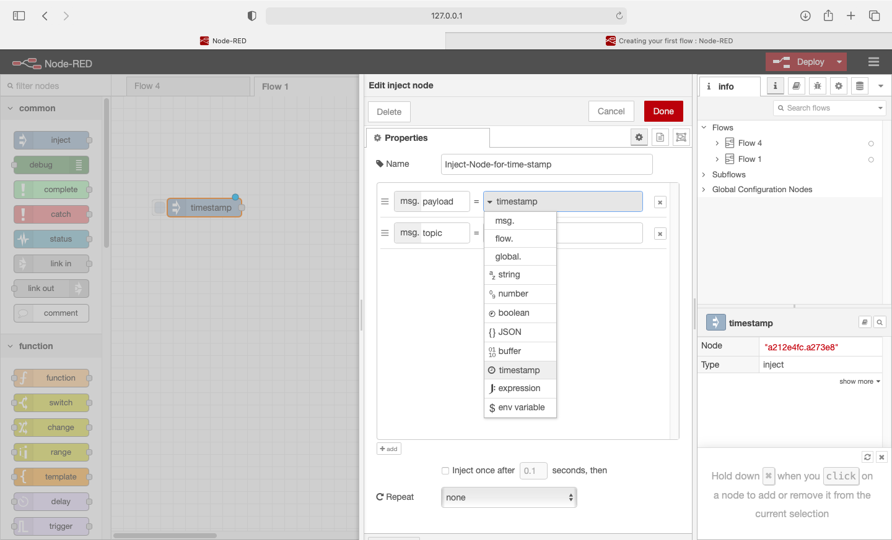
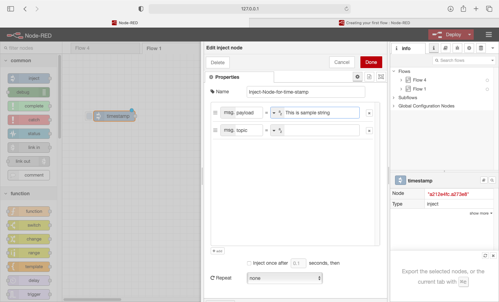
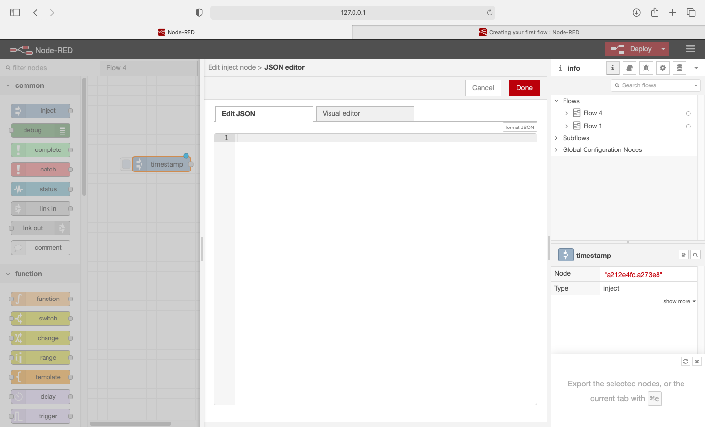
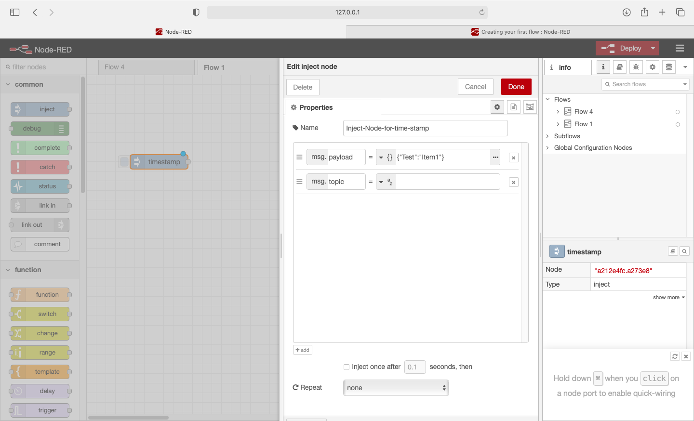

- Injects a message into a flow either manually or at regular intervals. The message payload can be a variety of types, including strings, JavaScript objects or the current time.

# 2 MQTT Out #
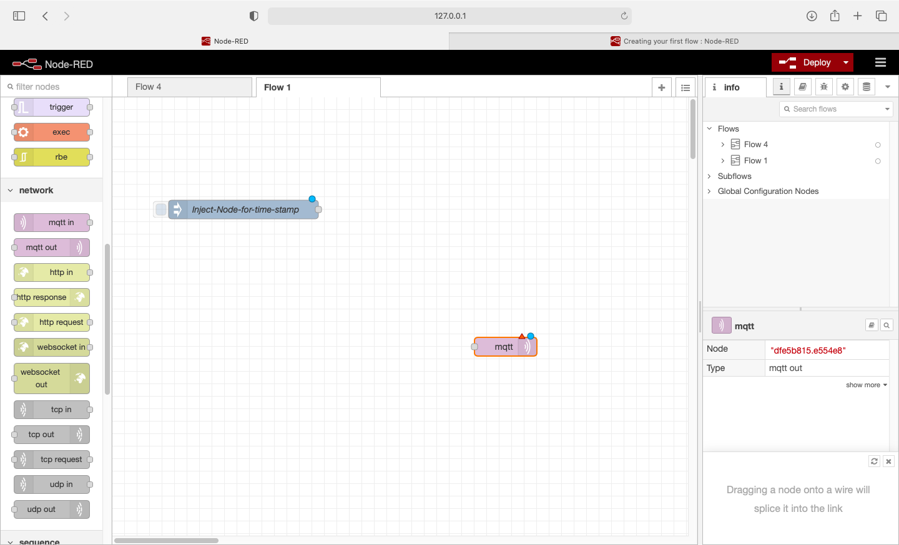
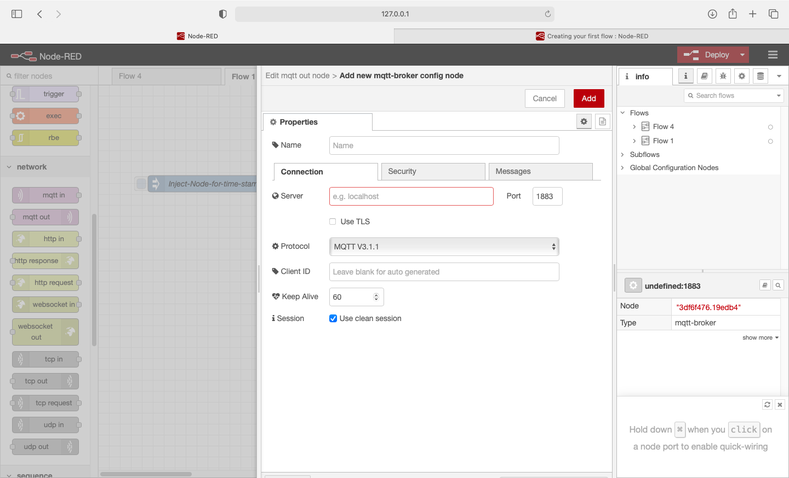
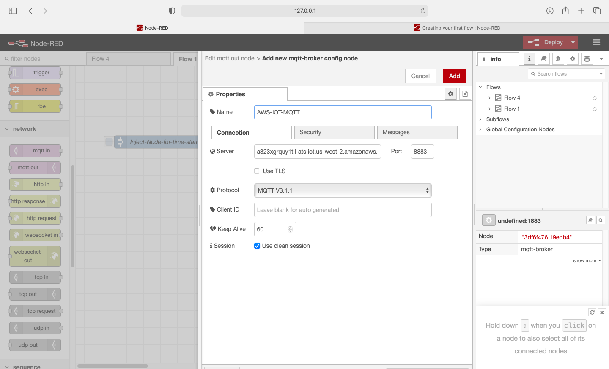

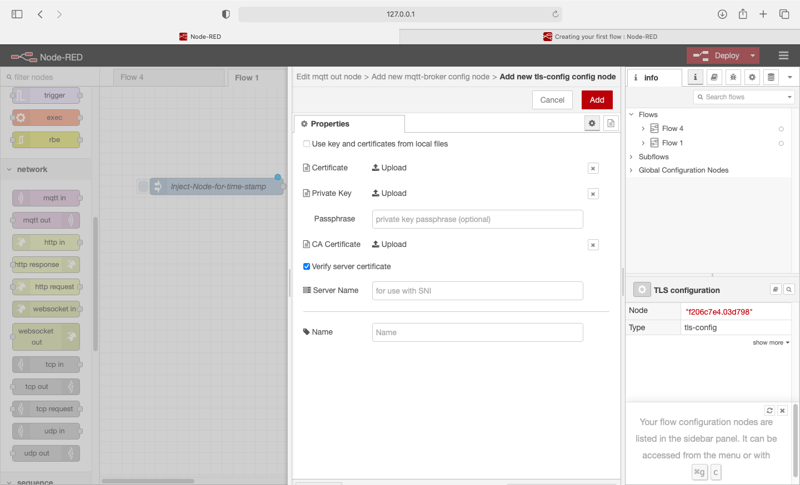
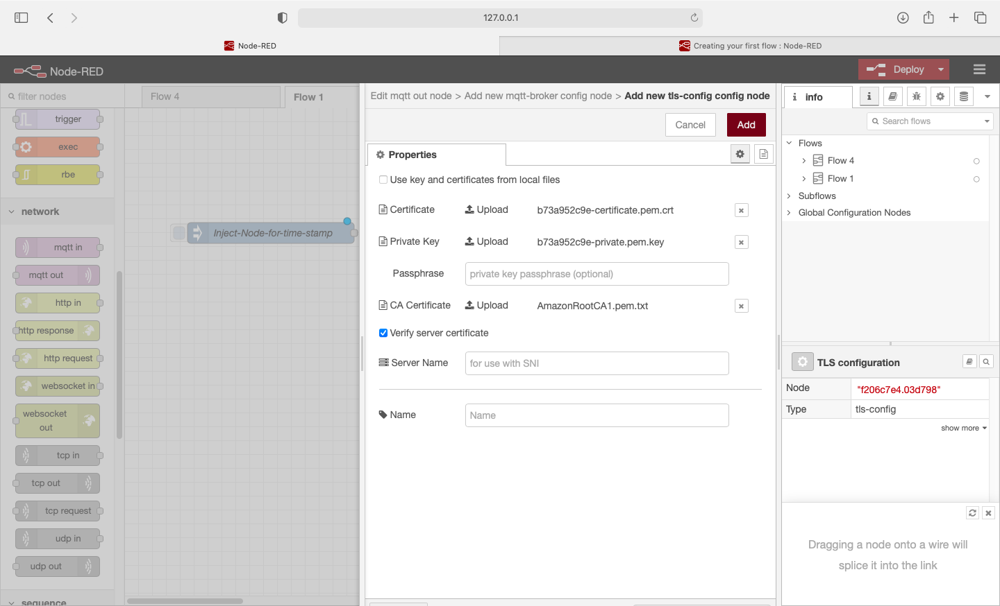
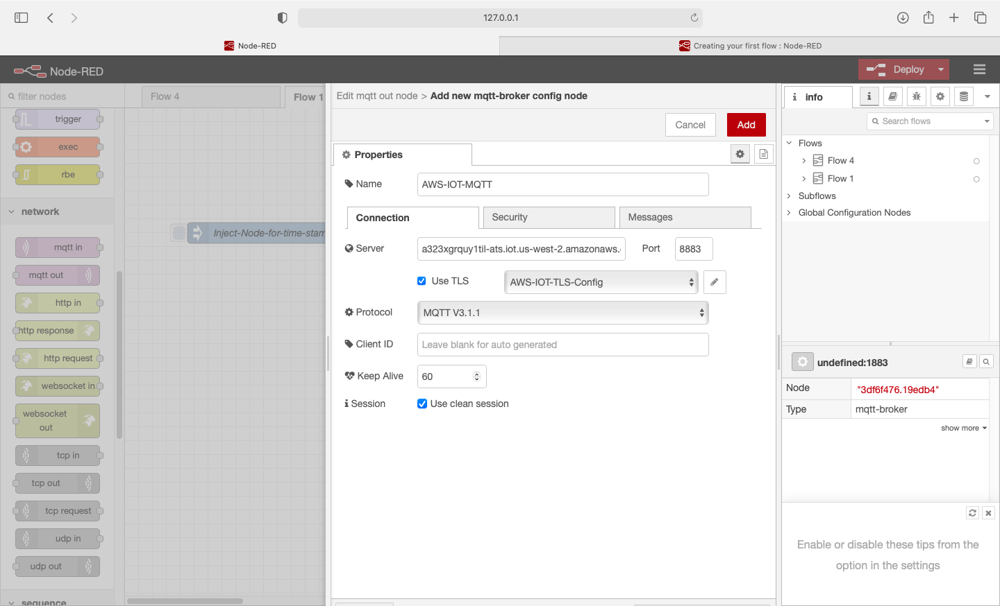
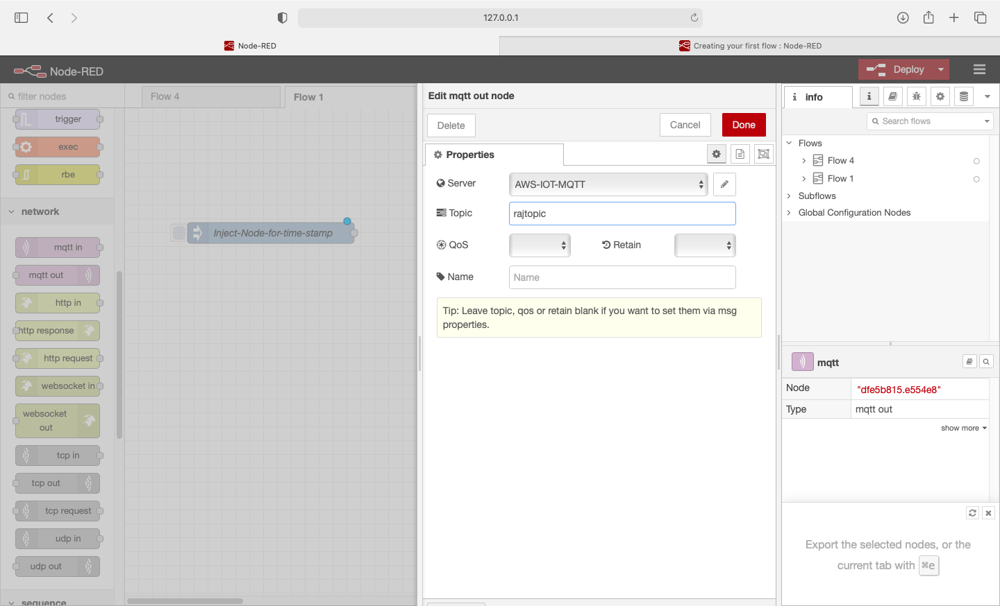

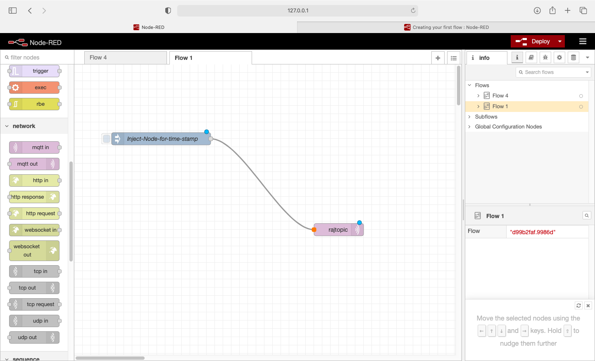
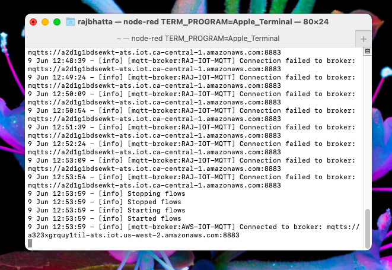

# 3 Accessing topic in AWS IOT #